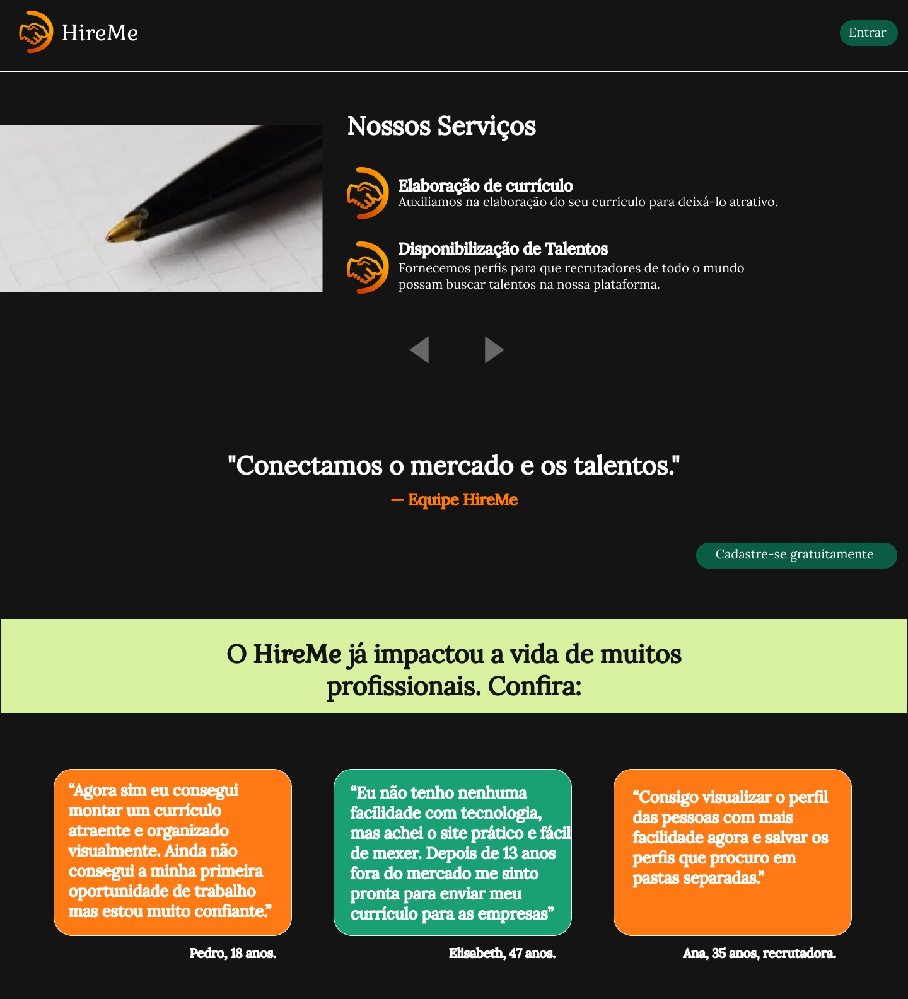
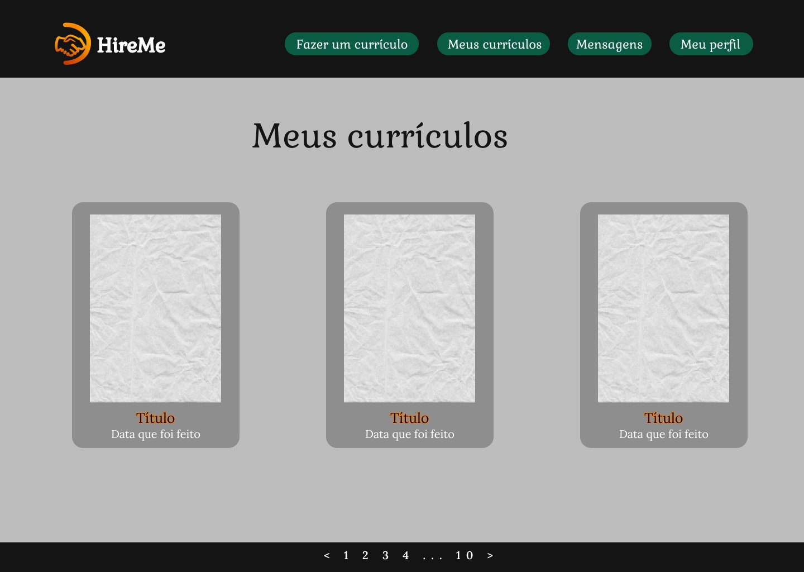
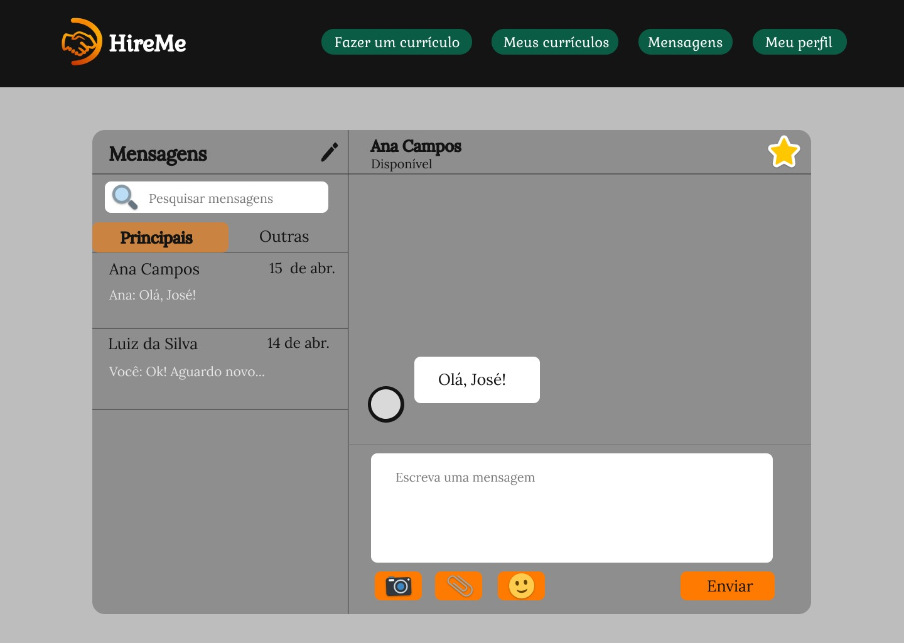

# Projeto de Interface

 Dentre as preocupações para a montagem da interface do sistema, foi estabelecido foco em agilidade e usabilidade para que a ferramenta alcance seu propósito. Sendo assim, nos itens abaixo será possível ter uma visão geral da interação do usuário pelas telas do sistema e o protótipo das telas com as funcionalidades que fazem parte do sistema.
  
 

## User Flow

 

  O fluxo de interação do usuário pelas telas do sistema é mostrado no fluxograma visto na Figura 2. Cada uma das telas deste fluxo é detalhada na seção de Wireframes a seguir. Para visualizar o wireframe interativo, acesse o ambiente do projeto no [Figma]
(https://www.figma.com/file/26xgkuRFG2tFlLcm2I9TeY/HireMe?node-id=0-1&t=E3KIpwSAFUs5dzEn-0).
  
 
 
 

**Figura 2** - Fluxo de Usuário

## Wireframes

A seguir são apresentados os protótipos de interface para indicar a estrutura e layout do site, bem como a interação entre suas páginas. 
 
### Tela - Página Inicial

 A tela de Página Inicial dá uma visão geral ao usuário do propósito do sistema e dos serviços oferecidos. As informações são disponibilizadas por meio de um carrossel. Além disso o usuário tem acesso a alguns depoimentos de pessoas que utilizaram o sistema e alcançaram seus objetivos. É também através dessa tela que o usuário pode fazer seu cadastro ou ir diretamente para o Login.
   
 

**Figura 3** - Tela Inicial

**Figura 4** - Tela Inicial

**Figura 5** - Tela Inicial
   

### Tela - Cadastro

 A tela de cadastro é utilizada para criar o acesso ao sistema. O usuário precisa informar seu email e definir uma senha de acesso. É nessa tela que o usuário define qual o seu objetivo na ferramenta: buscar profissionais (para recrutadores) ou criar e cadastrar o currículo (para profissionais que buscam uma oportunidade no mercado de trabalho). 
  
 

**Figura 6** - Tela Cadastro

**Figura 7** - Tela Cadastro

### Tela - Login

 Para os usuários que já possuem uma conta, o acesso é feito pela tela de Login. Para entrar basta informar o email e senha escolhida no momento do cadastro. Caso seja o primeiro acesso do usuário, ele poderá ser direcionado para a tela de cadastro também por essa tela. 
  
 

**Figura 8** - Tela Login/Entrar

### Tela - Perfil do profissional

 Tela de Perfil do profssional é o local onde o profissional vai fazer uma biografia e preencher informações pessoais como e-mail, telefone para contato, endereço e cargo que está atuando.
  
 

**Figura 9** - Tela Meu Perfil (perfil do profissional)

### Tela - Meus Currículos

 Tela onde o profissional poderá ver todos os currículos que criados, visualizando a data de criação e também o título nomeado.
  
  

**Figura 10** - Tela Meus currículos  
  
### Tela - Fazer um currículo

 Tela onde o profissional irá escolher o modelo de layout de currículo que irá criar. Nesta página além dos modelos, temos um indicativo de instruções de onde clicar quando selecionar para começar a preencher os dados.
  
 

**Figura 11** - Tela Fazer um currículo 

**Figura 12** - Tela Fazer um currículo 

### Tela - Preencher modelo de currículo

Tela onde o profissional irá preencher as informações para criar o currículo:

- formação: informar instituição, grau da formação, data de início e data de término.
- 
 experiências profissionais: informar cargo, empresa, data de início e término, ou selecionar se é o trabalho atual, e descrição de atividades.
  

- links e sites: indicar sites e links que possam trazer mais informações sobre o profissional.
- competências: selecionar principais competências para serem destacadas. 
- 
 campos extras: o profissional pode adicionar outros itens como idiomas, cursos, atividades extracurriculares, estágios, além de contar com um campo livre para preencher com outras informações que ache relevante. 
  

 O usuário poderá pré-visualizar o seu currículo com todas as informações preenchidas antes de concluir. Por fim, caberá ao usuário  optar em  compartilhar o seu currículo, deixando-o visível para os recrutadores que acessarem o site, ou copiar o link que permitirá acesso ao currículo na versão web ou apenas fazer o download em PDF.
  
 

**Figura 13** - Tela Preencher modelo de currículo

**Figura 14** - Tela Preencher modelo de currículo

**Figura 15** - Tela Preencher modelo de currículo

**Figura 16** - Tela Preencher modelo de currículo

### Tela - Perfil do recrutador

 A tela do perfil do recrutador vai funcionar como um cartão de visita do profissional, no qual é possível carregar uma foto, editar seu nome, cargo, infomações de contato, caso deseje, como e-mail e telefone bem como informações da empresa para qual trabalha.
  
 
  
  
**Figura 17** - Tela Meu Perfil (perfil do recrutador)

### Tela - Buscar profissionais

 Os recrutadores podem buscar currículos na tela Buscar profissionais. Para isso é possível fazer a busca utilizando palavras-chave por meio de uma pesquisa booleana. Além disso, existe a opção de filtros para que o resultado seja mais assertivo. Todos os currículos que sejam compatíveis com a busca feita pelo recrutador são apresentados de uma forma resumida, cabendo ao recrutador optar em ver o perfil completo e/ou marcar como favorito. 
   
 
  

**Figura 18** - Tela Buscar profissionais

### Tela - Favoritos

 Nessa tela será possível que o recrutados salve os currículos favoritos para poder encontrar com mais facilidades as informações daquele profissional em momento posterior. Mesmo que o candidato não seja selecionado para a primeira vaga, o recrutador, caso deseje, pode salvar para futuras oportunidades.
  
 

**Figura 19** - Tela Favoritos

### Tela - Mensagens

 A tela Mensagens é utilizada por todos os tipos de usuários e aqui é possível acessar as mensagens recebidas, bem como enviar uma mensagem. 
  
 

**Figura 20** - Tela Mensagem (perfil profissional)

**Figura 21** - Tela Mensagem (perfil recrutador)
