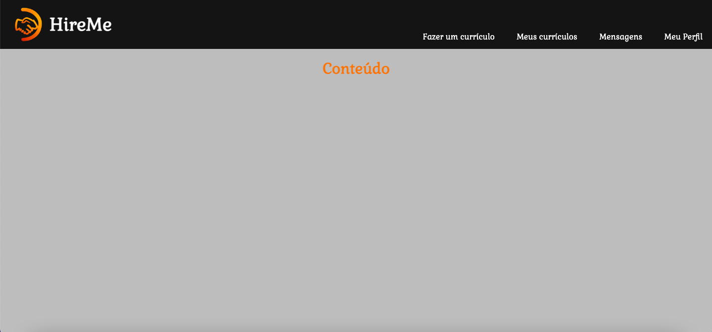
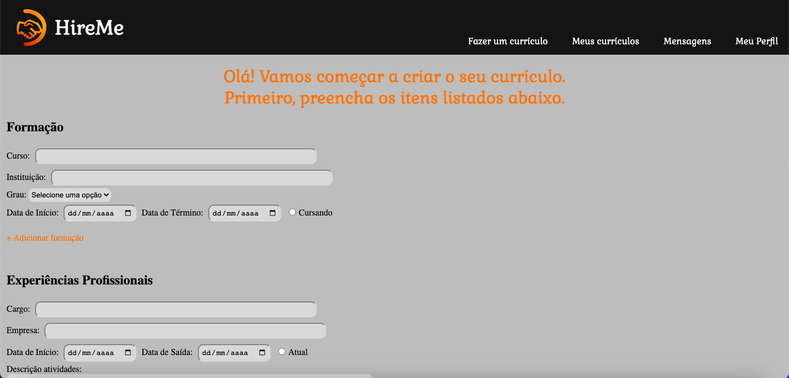
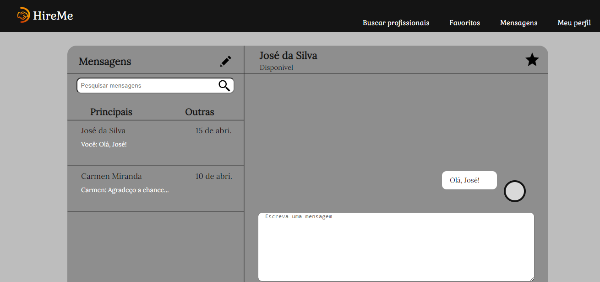

# Template padrão do site

O layout padrão a ser utilizado pelo site tem correspondência ao projeto de Interface elaborado anteriormente, conforme Figura X.

O template criado está disponível no site (https://github.com/ICEI-PUC-Minas-PMV-ADS/pmv-ads-2023-1-e1--proj-web-t8-hireme/tree/main) e é composto pelos seguintes layouts:
- Tela Inicial
- Tela de Cadastro
- Tela para criar um Currículo
- Tela do Perfil do recrutador
- Tela da Caixa de mensagens do recrutador

 
<b>Figura 22</b> - Layout Padrão

## Tela Inicial
Tela que fala sobre o objetivo do site, traz depoimentos de usuários e direciona ao cadastro ou ao login.

 
<b>Figura 23.1</b> - Tela de cadastro

 
<b>Figura 23.2</b> - Tela de cadastro

## Tela de Cadastro
Tela que permite qualquer pessoa que esteja no site faça seu cadastro para usufruir dos serviços disponibilizados. 

 
<b>Figura 24</b> - Tela de cadastro

## Tela para criar um Currículo
Tela que disponibiliza todos os campos que devem ser preenchidos pelo usuário para criar seu currículo.

 
<b>Figura 25</b> - Tela para criar um Currículo

## Tela do Perfil do recrutador

**Figura 26** - Tela do Perfil do recrutador

## Tela da Caixa de mensagens do recrutador
Tela que permite que o recrutador entre em contato com candidatos que possuem um currículo que os interessa.

 
<b>Figura 27</b> - Tela da Caixa de mensagens do recrutador

