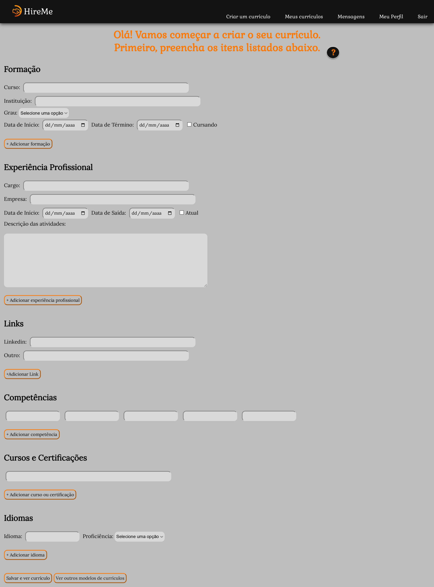
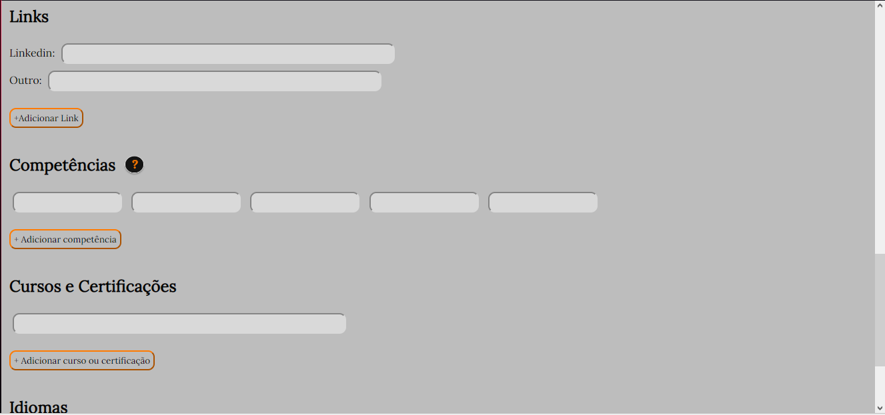
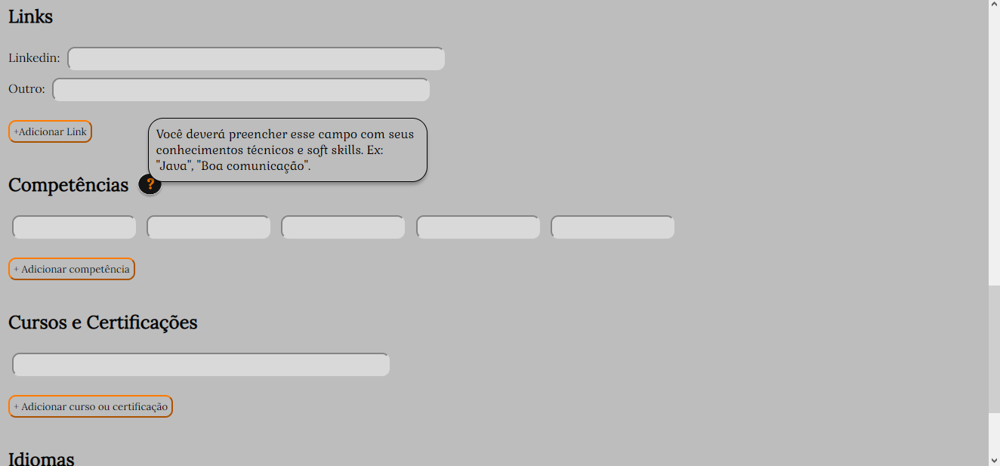
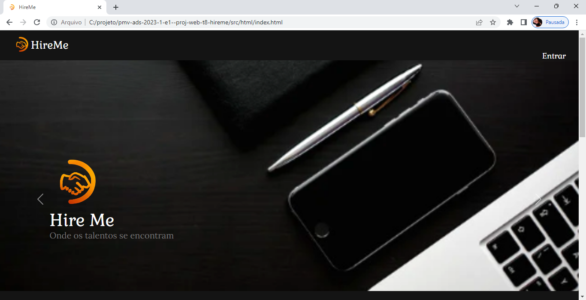
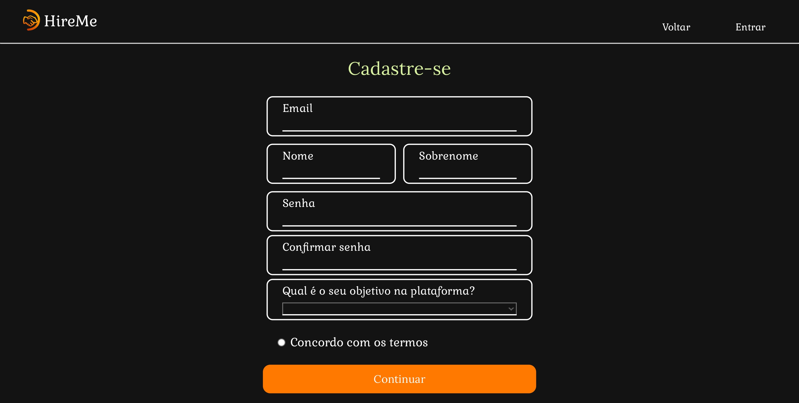
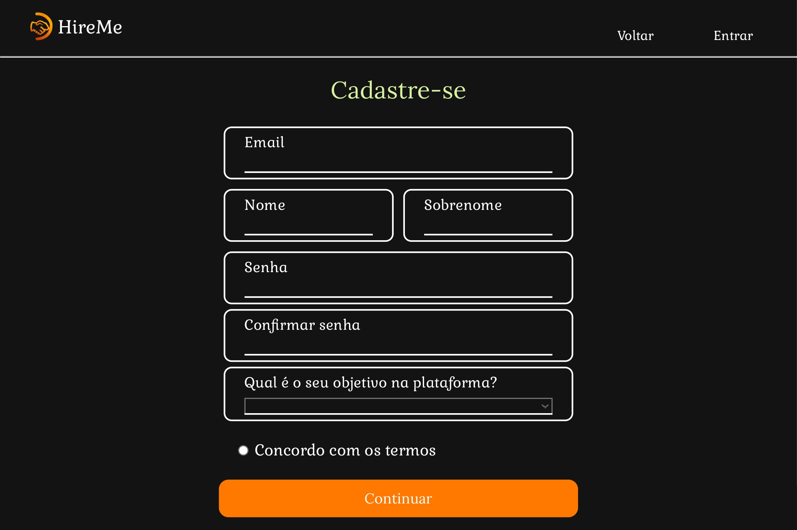
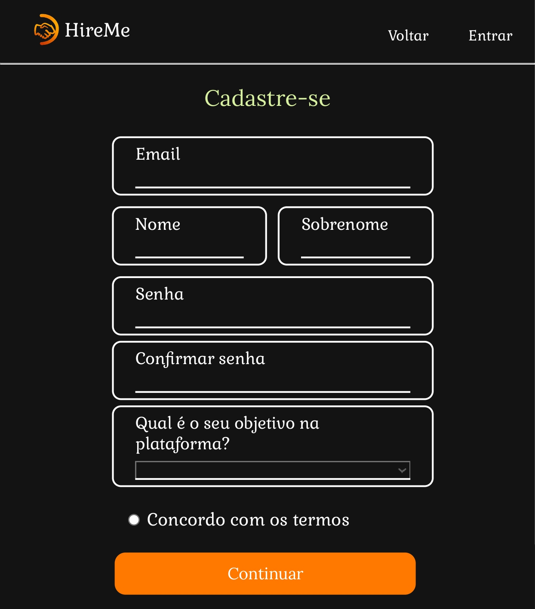
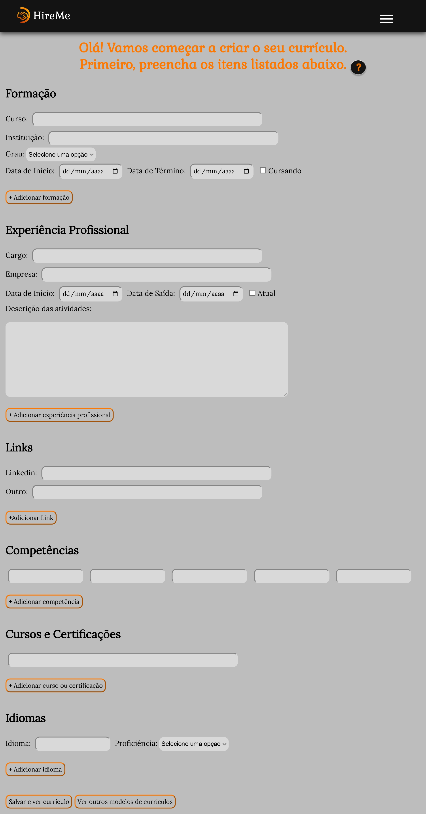
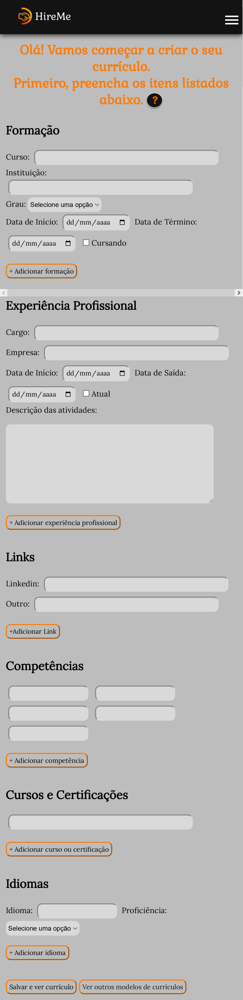

# Registro de Testes de Software

Os resultados obtidos nos testes de software realizados são descritos abaixo.

## CT01 - Página Inicial

- Testar o link para o Login.

  
  

 

  
  

- Testar o link para o Cadastro.

  
  

 

  
  

  
## CT02 - Separação de telas entre candidatos e recrutadores
  
  - Cadastro e Login do candidato
  

  
  

    

  
  

 

  
  

  - Cadastro e Login do recrutador
   

  
  

  

  
  

 

  
  

  
## CT03 - Criação, edição e compartilhamento de currículo

- Fazer Login e acessar a página de Perfil do candidato.

  

- Clicar no menu principal na opção Criar um currículo.

  

- Preencher as informações pedidas para o currículo, como habilidades e experiências

  

 
- Clicar em Salvar e ver currículo para ser redirecionado para a página com as informações do seu currículo

  

  
- Escolher se irá compartilhar o currículo na plataforma HireMe, fazer download do currículo com o layout escolhido e/ou copiar o link do currículo.

  

## CT04 - Testar filtros de busca de pessoas de acordo com as experiências
- Acessar a página Buscar profissionais

  

- Digitar no campo de pesquisa os filtros profissionais que está buscando e clicar Enter para selecionar

  

## CT05 - Caixa de mensagens

- Acessar a página Buscar profissionais.
- Digitar no campo de pesquisa os filtros profissionais que está buscando e clicar Enter para pesquisar currículos.

  

  

- Ao escolher um currículo, clicar no botão Enviar mensagem.

  

  

## CT06 - Currículos favoritados
- Acessar a página Buscar profissionais.
- Digitar no campo de pesquisa os filtros profissionais que está buscando e clicar Enter para pesquisar currículos.

  

  
- Quando um currículo chamar atenção, clicar no botão de favoritar, em forma de coração, presente no box do currículo.

  

## CT07 - Botão de dicas

- Testar o botão de dicas na página de Criar um currículo.

  
  

  
  

## CT08 - Compatibilidade e Responsividade

- Testar compatibilidade com os principais navegadores do mercado.

 
  <b>Microsoft Edge</b>  
  

 
  <b>Google Chrome</b>  
  

  
- Testar responsividade em diferentes tamanhos de telas.
   - Ex: Página de Cadastro.

 
  <b>Tela desktop</b>  
  

 

 
  <b>Tela tablet</b>  
  

   

   
  <b>Tela mobile</b>  
  

  
  - Ex: Página para criar um currículo.

 
  <b>Tela desktop</b>  
  

 

 
  <b>Tela tablet</b>  
  

   

   
  <b>Tela mobile</b>  
  

