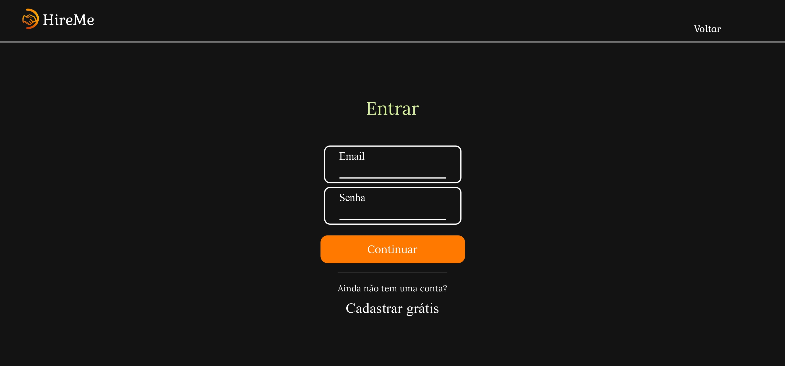
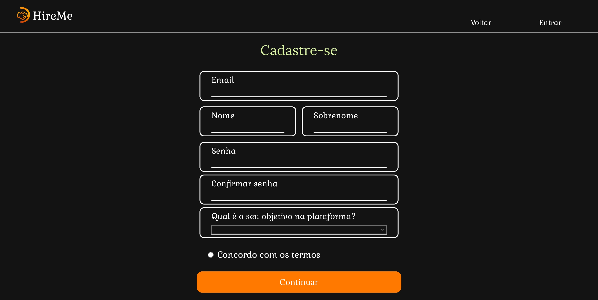
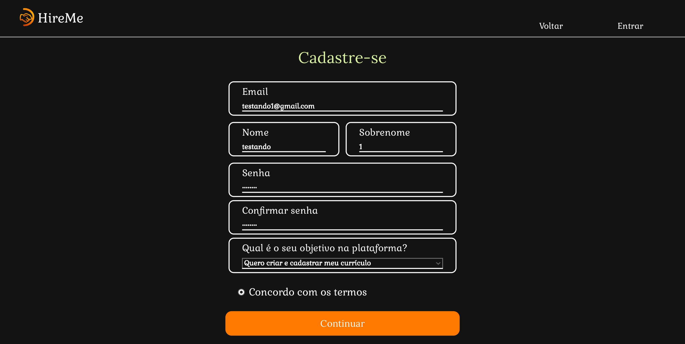
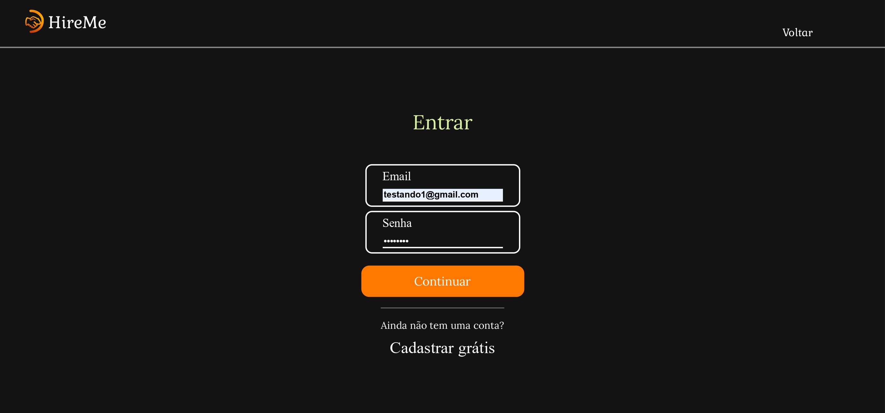
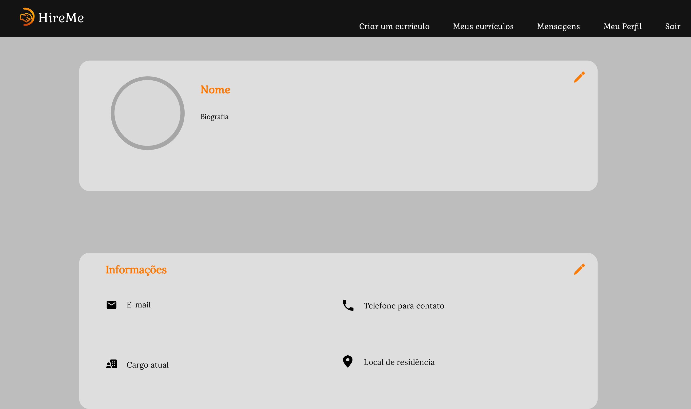
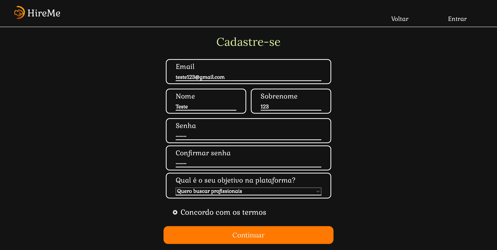
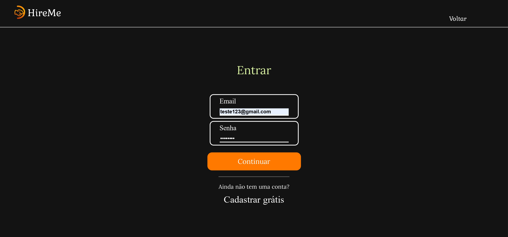
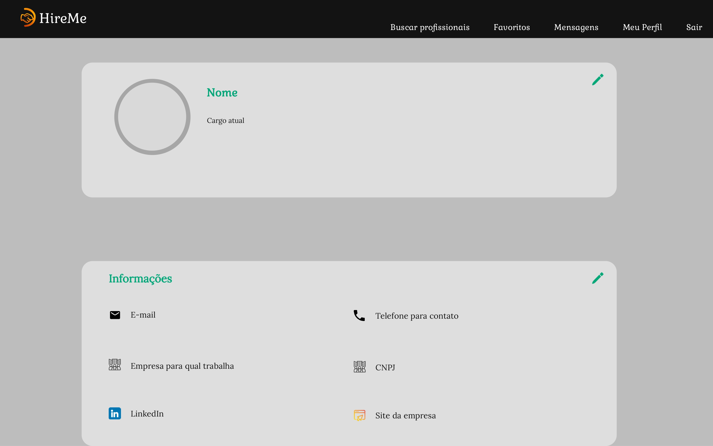

# Registro de Testes de Software

Os resultados obtidos nos testes de software realizados são descritos abaixo.

## CT01 - Página Inicial

- Testar o link para o Login.

  
  

 

  
  

- Testar o link para o Cadastro.

  
  

 

  
  

  
  ## CT02 - Separação de telas entre candidatos e recrutadores
  
  - Cadastro e Login do candidato
  

  
  

    

  
  

 

  
  

  - Cadastro e Login do recrutador
    

  
  

    

  
  

 

  
  

